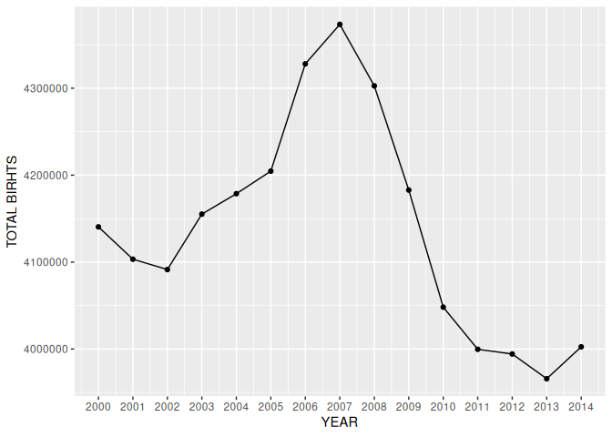

Births from 2000 to 2014
================

Data for this example is taken from [this
repository](https://github.com/fivethirtyeight/data/blob/master/births/US_births_2000-2014_SSA.csv).
This example uses sqlite 3 but explains what to change to use other
methods like Azure SQL Database (used by SQL Server Management Studio).
Really only one line in the following R code chunk needs to be changed
to use other methods. This github flavored markdown file is generated
from [this rmarkdown file](rmarkdown-and-sql-built-births-display.rmd).

# Connecting to the SQL Server

``` r
library('DBI')
library('reshape')
con <- dbConnect(RSQLite::SQLite(), dbname = "rmarkdown-and-sql-built-births-display.db")
birth_data <- read.csv('https://raw.githubusercontent.com/fivethirtyeight/data/master/births/US_births_2000-2014_SSA.csv')
melted_birth_data <- melt(birth_data, id = "year", measure = "births")
birth_data_by_year <- as.data.frame(cast(melted_birth_data, year~variable, sum))
dbWriteTable(con, "births2000_2014", birth_data_by_year, overwrite = TRUE)
```

For this example to work one must have DBI, reshape and RSQLite R
packages installed. One also needs to have RSQLite for one’s OS
installed too. If one is using a different SQL database type then one
needs to have that installed on their OS and have the appropriately DBI
supported R package for that type installed as well ([see this for
supported DBI backend packages](https://dbi.r-dbi.org/)). One would also
have to have the dbConnect call of line 3 of the above R code chunk
changed to the call appropriate for the given database type.

## Example with Azure SQL Database

Change line 3 of the above R code chunk to the following:

``` r
con <- dbConnect(AzureKusto::AzureKusto(), server="https://azure-database-url.net",
database="desired-database", tenantid="appropriate-azure-tenantid")
```

. Of course AzureKusto R package must be installed as well.

# Displaying Table with SQL Code Block

``` sql
SELECT * FROM births2000_2014
WHERE births > 4200000;
```

<div class="knitsql-table">

| year |  births |
|:-----|--------:|
| 2005 | 4211941 |
| 2006 | 4335154 |
| 2007 | 4380784 |
| 2008 | 4310737 |

4 records

</div>

This is merely to show that it is possible to display tables generated
from SQL code chunks. For more customisation one should use R packages
within R code chunks like shown in the next section.

# Displaying Data from R Code Chunks

``` r
library('ggplot2')
my_birth_data_peak_week_day = list()
my_birth_data_peak_week_day_births = list()
my_birth_data_peak_month = list()
my_birth_data_peak_month_births = list()
my_birth_data_average_births_per_month = list()
my_birth_data_total_births = list()
my_birth_data_year = list()
total_births_by_day_of_week = c(0, 0, 0, 0, 0, 0, 0)
total_births_by_month = c(0, 0, 0, 0, 0, 0, 0, 0, 0, 0, 0, 0)
for (i in 1:length(birth_data$year)) {
    year = birth_data$year[i]
    if (year %in% my_birth_data_year) {
        total_births_by_day_of_week = total_births_by_day_of_week
        total_births_by_month = total_births_by_month
        births = birth_data$births[i]
        week_day = birth_data$day_of_week[i]
        month = birth_data$month[i]
        total_births_by_day_of_week[week_day] = total_births_by_day_of_week[week_day] + births
        total_births_by_month[month] = total_births_by_month[month] + births
        total_births_by_day_of_week <<- total_births_by_day_of_week
        total_births_by_month <<- total_births_by_month
    } else {
        if (i > 1) {
            my_birth_data_peak_week_day = my_birth_data_peak_week_day
            my_birth_data_peak_week_day_births = my_birth_data_peak_week_day_births
            my_birth_data_peak_month = my_birth_data_peak_month
            my_birth_data_peak_month_births = my_birth_data_peak_month_births
            my_birth_data_average_births_per_month = my_birth_data_average_births_per_month
            my_birth_data_total_births = my_birth_data_total_births
            peak_week_day_births = max(total_births_by_day_of_week)
            peak_week_day = which(total_births_by_day_of_week == peak_week_day_births)[1]
            peak_month_births = max(total_births_by_month)
            peak_month = which(total_births_by_month == peak_month_births)[1]
            my_birth_data_peak_week_day <<- append(my_birth_data_peak_week_day, peak_week_day)
            my_birth_data_peak_week_day_births <<- append(my_birth_data_peak_week_day_births, peak_week_day_births)
            my_birth_data_peak_month <<- append(my_birth_data_peak_month, peak_month)
            my_birth_data_peak_month_births <<- append(my_birth_data_peak_month_births, peak_month_births)
            total_births = sum(total_births_by_day_of_week)
            my_birth_data_total_births <<- append(my_birth_data_total_births, total_births)
            my_birth_data_average_births_per_month <<- append(my_birth_data_average_births_per_month, total_births/12)
            total_births_by_day_of_week <<- c(0, 0, 0, 0, 0, 0, 0)
            total_births_by_month <<- c(0, 0, 0, 0, 0, 0, 0, 0, 0, 0, 0, 0)
        }
        my_birth_data_year = my_birth_data_year
        my_birth_data_year <<- append(my_birth_data_year, year)
    }
}
peak_week_day_births = max(total_births_by_day_of_week)
peak_week_day = which(total_births_by_day_of_week == peak_week_day_births)[1]
peak_month_births = max(total_births_by_month)
peak_month = which(total_births_by_month == peak_month_births)[1]
my_birth_data_peak_week_day <<- append(my_birth_data_peak_week_day, peak_week_day)
my_birth_data_peak_week_day_births <<- append(my_birth_data_peak_week_day_births, peak_week_day_births)
my_birth_data_peak_month <<- append(my_birth_data_peak_month, peak_month)
my_birth_data_peak_month_births <<- append(my_birth_data_peak_month_births, peak_month_births)
total_births = sum(total_births_by_day_of_week)
my_birth_data_total_births <<- append(my_birth_data_total_births, total_births)
my_birth_data_average_births_per_month <<- append(my_birth_data_average_births_per_month, total_births/12)
my_birth_data = data.frame(year = unlist(my_birth_data_year), peak_week_day = unlist(my_birth_data_peak_week_day), peak_week_day_births = unlist(my_birth_data_peak_week_day_births), peak_month = unlist(my_birth_data_peak_month), peak_month_births = unlist(my_birth_data_peak_month_births), average_births_per_month = unlist(my_birth_data_average_births_per_month), total_births = unlist(my_birth_data_total_births))
knitr::kable(my_birth_data)
```

| year | peak_week_day | peak_week_day_births | peak_month | peak_month_births | average_births_per_month | total_births |
|-----:|--------------:|---------------------:|-----------:|------------------:|-------------------------:|-------------:|
| 2000 |             2 |               669284 |          8 |            367893 |                 345042.9 |      4140515 |
| 2001 |             2 |               665152 |          8 |            369383 |                 341941.7 |      4103300 |
| 2002 |             2 |               673346 |          8 |            366409 |                 340948.8 |      4091386 |
| 2003 |             2 |               690008 |          7 |            370236 |                 346262.7 |      4155152 |
| 2004 |             2 |               692084 |          7 |            365380 |                 348221.5 |      4178658 |
| 2005 |             2 |               698828 |          8 |            376467 |                 350385.3 |      4204624 |
| 2006 |             3 |               714113 |          8 |            394199 |                 360668.1 |      4328017 |
| 2007 |             2 |               718391 |          8 |            396355 |                 364455.2 |      4373462 |
| 2008 |             2 |               715084 |          7 |            380707 |                 358560.2 |      4302723 |
| 2009 |             2 |               705056 |          7 |            373491 |                 348570.5 |      4182846 |
| 2010 |             2 |               677758 |          9 |            355887 |                 337342.0 |      4048104 |
| 2011 |             2 |               668543 |          8 |            364194 |                 333304.5 |      3999654 |
| 2012 |             2 |               653369 |          8 |            365501 |                 332853.2 |      3994239 |
| 2013 |             2 |               653308 |          8 |            356879 |                 330483.3 |      3965800 |
| 2014 |             2 |               661677 |          7 |            357476 |                 333542.8 |      4002514 |

``` r
my_birth_data$year = as.Date(my_birth_data$year)
ggplot(my_birth_data, aes(x = year, y = total_births)) + geom_point() + labs(x = "YEAR", y = "TOTAL BIRHTS") + scale_x_date(date_breaks = "1 year")
```

<!-- -->

# Disconnecting from the SQL Server

``` r
dbDisconnect(con)
```
