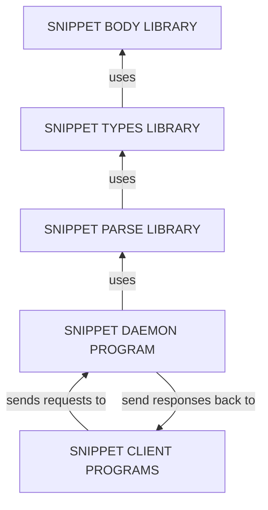
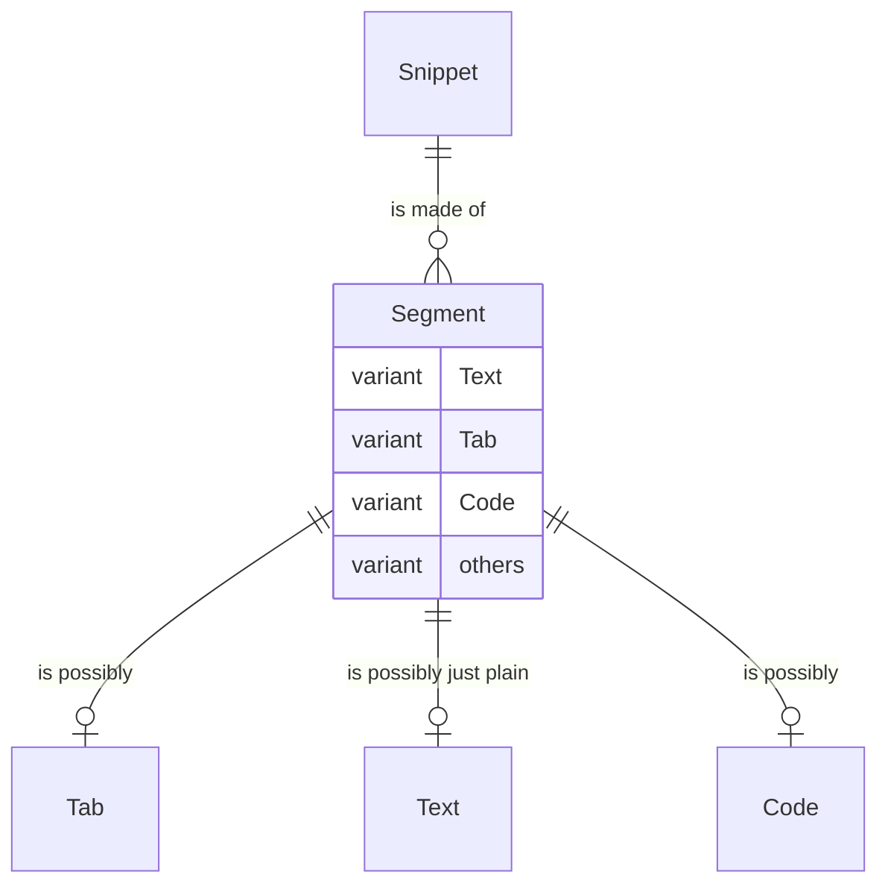
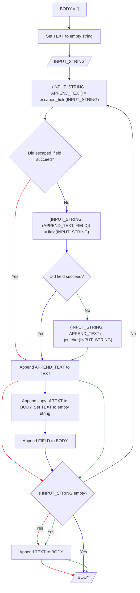

# Examples in Progress

I am currently in the middle of writing a OS and text editor agnostic snippet manager like those found in vscode, textmate and sublime text. It will be a universal daemon or background process written in rust. There will be different clients for each text editor but the communication protocol being used to communicate with daemon will be the same. So implementing a client for a given text editor should be trivial. It's just output request in the form of text within a given format and get text back as a response to and from the deamon. How the responses are handled will differ based on the client as the needs of the text editors they are designed for differ. This will allow snippets to be designed in the same format and with the same functionality accross all possible text editors and OSes. In addition I am writing libraries for this snippet manager in rust. I am implementing features and conditional compilation so people can control what functionality they want in their snippet manager. The libraries will also be divided so that functionality and parsing format could easily be reimplemented differently to easily build a different text editor and OS agnostic snippet manager daemon.

# Structure of Libraries and Programs

## SNIPPET BODY LIBRARY

Defines the structure of a snippet. Essentially provides a rust struct called Snippet, a rust enum called Segment and several other structs. The enum Segment defines every general type of portion that can comprise a snippet. For example, in addition to regular text there is also tabs (user inputted text) and code (program inputted text) - amoung other types. Snippet is essentially a collection of Segment vecs. The several other structs are typically used within the Segment enum variants. For example, the Tab and Code structs are used within the Code and Tab variants. Also the Code and Tab structs have different types as specified by their interpreter and field field respectively. These fields are trait objects so as to allow the users of this library to specify their own type of Tab and Code structs - future proofing this library. Lastly Code struct and the several other structs that are used withing the Segment enum variants (with the exception of Tab and Text) are conditionally compiled based on feature flags.

## SNIPPET TYPES LIBRARY

Defines implementors of Field and Interpreter traits. Only Placeholder implementor of Field is not conditionally compiled. Everything else is.

## SNIPPET PARSE LIBRARY

Defines a function that takes a string and outputs a snippet. The Body of this funciton (displayed in the figure below), furthermore, is comprised of a funtion that parses non regular text made regular through escaping (escaped_field), unescaped nonregular text (field) and regular text (get_char).

## SNIPPET DAEMON AND CLIENT PROGRAMS

The daemon shall be a background process cli program typically started in something like a shell script and the clients shall be programs implemented in the language most appropriate for the text editor they are designed for. The clients shall send requests to and receive responses from the daemon in the same format but handle them differently depending on the text editor they are made for. Same format and functionality for different text editors and OSes.
